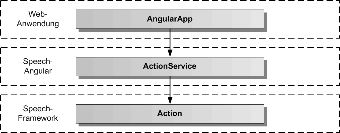
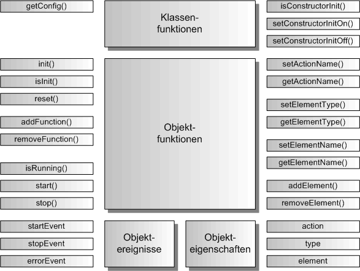

# ActionService

Der ActionService dient zum Weiterreichen einer Aktion an eine AngularApp. Dazu meldet die AngularApp Aktionsfunktionen oder Aktionselemente bei dem ActionService an, um über auszuführende Aktionen informiert zu werden.

## Architektur

In der folgenden Grafik werden die einzelnen Schichten, angefangen von der AngularApp, über den ActionService von Speech-Angular, bis zur Action-Komponente in Speech-Framework, dargestellt. 

## API

Der ActionService definiert die öffentliche Schnittstelle von Speech-Angular für die Aktionsverarbeitung. Die folgende Grafik zeigt einen Überblick über die gesamte API des ActionServices. Die API teilt sich auf in statische Klassenfunktionen, Objektfunktionen, Objektereignisse und Objekteigenschaften. Die API verfügt über eine auf Funktionen und eine auf Eigenschaften basierende Schnittstelle. Die gleiche Aufgabe kann über Funktionsaufrufe oder über das Setzen von Eigenschaften erledigt werden. Z.B. kann die auszuführende Aktion entweder mit actionService.setActionName('blink') oder mit actonService.action = 'blink' eingetragen werden, bevor mit actionService.start() die Aktionsausführung gestartet wird.

Die statischen Klassenfunktionen dienen der Konfiguration des ActionService vor seiner Erzeugung, sowie der Festlegung, ob die init()-Funktion im Konstruktor von ActionService bereits aufgerufen wird oder nicht. Dazu werden die Klassenfunktionen mit dem Klassennamen ActionService aufgerufen, wie z.B. die Rückgabe der Konfiguration mit ActionService.getConfig().
Die Objektereignisse geben Angular-EventEmitter zurück, diese sollten mit subscribe aufgerufen werden und die Rückgabe sollte in einer Variablen für den Aufruf von unsubscribe gespeichert werden:

	// Setzen einer Ereignisfunktion mit subscribe
	const errorEvent = actionService.errorEvent.subscribe( aError => console.log('Fehlerausgabe:', aError.message));
	...
	// Freigabe der Ereignisfunktion mit unsubscribe
	errorEvent.unsubscribe();

## Importieren

Um den ActionService importieren zu können, muss in der jeweiligen Komponente folgende Zeile eingefügt werden:

	import { ActionService } from 'speech-angular'
	
Dazu muss das Speech-Angular npm-Paket vorher ins eigene AngularApp-Projekt kopiert und installiert worden sein.

	$ npm install --save speech-angular-0.5.0.tgz
	 

## Konfiguration

Dier erste Aufgabe vor Nutzung des ActionService besteht in der Festlegung der Konfiguration vor der Erzeugung des Services in Angular. In der Defaulteinstellung wird die init()-Funktion im Konstruktor aufgerufen und die voreingestellte Konfiguration übernommen. Will man die Defaultkonfiguration überschreiben, holt man sie sich mittels der Klassenfunktion ActionService.getConfig(). Diese Funktion gibt das ActionConfig-Objekt des ActionServices zurück. 

Auszug aus der Datei: src/speech/action/action-service-config.ts:

	// hier sind die Defaultwerte des ActionService festgelegt	
	export const ActionServiceConfig: ActionServiceOptionInterface = {
		/** ein/ausschalten der Aktionskomponente */
		activeFlag: true,
		/** legt fest, ob die Fehlermeldungen zusaetzlich auf der Konsole ausgegeben werden */
		errorOutputFlag: false
	};

Die Konfiguration kann man nur in app.module.ts vornehmen, da sie vor der Erzeugung des ActionService stattfinden muss.

Auszug aus der Datei: src/app/app.module.ts:

	import { BrowserModule } from '@angular/platform-browser';
	import { NgModule } from '@angular/core';
	
	import { AppComponent } from './app.component';
	
	// ActionService
	
	import { ActionService } from 'speech-angular';
	
	
	@NgModule({
	  declarations: [
	    AppComponent
	  ],
	  imports: [
	    BrowserModule
	  ],
	  providers: [ActionService],
	  bootstrap: [AppComponent]
	})
	export class AppModule {
		
		// nur hier kann die ActionService-Konfiguration geaendert werden
		constructor() {
			// ActionService-Konfiguration holen
			const actionServiceConfig = ActionService.getConfig();
			// hier kann man alle Konfigurationswerte aendern, diese werden bei der Initialsierung uebernommen
			// es muessen nur die von den Defaultwerten abweichenden Werte eingetragen werden
			actionServiceConfig.errorOutputFlag = true;
		}
	
	}

Soll die init()-Funktion manuell nach der Erzeugung des ActionService aufgerufen werden, so muss im AppModule-Konstruktor die Klassenfunktion ActionService.setConstructorInitOff() aufgerufen werden. Damit schaltet man den Aufruf von init() im ActionService-Konstruktor aus.

Auszug aus der Datei: src/app/app.module.ts:

	... 
	export class AppModule {
		
		// nur hier kann die ActionService-Konfiguration geaendert werden, da der Konstruktor von ActionService
		// noch nicht aufgerufen worden ist
		constructor() {
			ActionService.setConstructorInitOff();
		}
	
	}

Die init()-Funktion kann man dann zu einem beliebig späteren Zeitpunkt z.B. in der AppComponent mit eigenen optionalen Parametern aufrufen.

Auszug aus der Datei: src/app/app.component.ts:

	import { Component, OnInit } from '@angular/core';
	
	// ActionService
	
	import { ActionService } from 'speech-angular';
	
	// App-Komponente
	
	@Component({
		selector: 'app-root',
		templateUrl: './app.component.html',
		styleUrls: ['./app.component.css']
	})
	export class AppComponent implements OnInit {
	
	  title = 'Speech-Angular-App';
	
	  constructor( private actionService: ActionService ) {}
	
		ngOnInit(): void {
			// Hier wird der ActionService manuell mit optionalen Parametern initialisiert
	  		this.actionService.init({ errorOutputFlag: true });
	  	}
	
	}

## Service ein/ausschalten 

Der ActionService kann aktiviert und deaktiviert werden. Zu Beginn ist er defaultmäßig immer aktiviert, es sei denn, man hat in der Konfiguration das activeFlag auf false gesetzt. Für das Setzen auf aktiv ein/aus kann man die Funtionen actionService.setActiveOn() und actionService.setActiveOff() benutzen, oder man setzt die Eigenschaft actionService.active auf true oder false. Ist der ActionService aktiv, werden alle Aktionen durchgeführt, ist der Service deaktiviert, werden global keine Aktionen ausgeführt. Prüfen kann man den Aktivzustand über actionService.isActive()-Funktion oder man liest die Eigenschaft actionService.active aus. 

	// ActionService einschalten per Funktion
	actionService.setActiveOn();
	// oder per Eigenschaft
	actionService.active = true;
	
	// ActionService ausschalten per Funktion
	actionService.setActiveOff();
	// oder per Eigenschaft
	actionService.active = false;
	
	// Abfrage auf aktiv per Funktion
	if ( actionService.isActive()) { ... }
	// oder per Eigenschaft
	if ( actionService.active ) { ... }
	
	

## Fehlerausgabe auf die Entwicklerkonsole

Bei der Integration des ActionService ist es mitunter sinnvoll, seine Fehlerausgaben auf die Entwicklerkonsole sofort auszugeben, um die Ursache eines Problems schneller finden zu können. Dazu kann die Fehlerausgabe auf die Konsole ein- und ausgeschaltet werden. Mit den Funktionen actionService.setErrorOutputOn() und actionService.setErrorOutputOff() kann man die Fehlerausgabe ein- und ausschalten. Mit der actionService.isErrorOutput()-Funktion kann man den Zustand für die Fehlerausgabe abfragen. Für das Setzen der Fehlerausgabe gibt es die Eigenschaft actionService.errorOutput, in die man true oder false eintragen kann, die man aber auch auslesen kann. Das errorOutputFlag kann auch in der Konfiguration gesetzt werden.  

	// Fehlerausgabe einschalten per Funktion
	actionService.setErrorOutputOn();
	// oder per Eigenschaft
	actionService.errorOutput = true;
	
	// Fehlerausgabe ausschalten per Funktion
	actionService.setErrorOutputOff();
	// oder per Eigenschaft
	actionService.errorOutput = false;
	
	// Abfrage auf Fehlerausgabe per Funktion
	if ( actionService.isErrorOutput()) { ... }
	// oder per Eigenschaft
	if ( actionService.errorOutput ) { ... }

## Aktionen ausführen/stoppen

Um eine Aktion ausführen zu können, müssen zuerst die Start- und Stop-Callback Funktionen für eine Aktion zum ActionService hinzugefügt werden. Vor dem Aufruf von ActionService.start() sollten die Eigenschaften actionService.action, sctionServie.type und actionService.element eingetragen werden.

## Aktionsfunktionen hinzufügen/entfernen

Um Aktionen ausführen zu können gibt es zwei Möglichkeiten, seine Callback-Funktionen für eine Aktion hinzuzufügen. Es kann ein Aktionsname festgelegt werden, unter dem man die Start- und Stop-Callbacks der Aktion hinzufügt. Oder man definiert ein Aktionselement, unter dessen Namen man die Start- und Stop-Callbacks der Aktion hinzufügt.

Hier wird die erste Möglichkeit beschrieben. Eine Aktion wird mit ihren Namen festgelegt und unter diesem Aktionsnamen werden die Start- und Stop-Callbacks eingetragen. Dann kann man die Aktion mit diesem Aktionsnamen ausführen. Der vorher eingetragene Start-Callback zu diesem Aktionsnamen wird daraufhin aufgerufen. Der startEvent wird zusätzlich gesendet.
Der Start-Callback Funktion werden der Aktionsname, der Elementtyp und der Elementname übergeben.

Auszug aus der Datei: src/speech/action/action-service-data.interface.ts:

	// diese Daten werden der Start-Callback Funktion mit uebergeben

	export interface ActionServiceDataInterface {
	    /** definierte Aktion, ist ActionName in ActionService */
	    action: string;
	    /** Objekttyp fuer die Aktion, ist ElementType in ActionService */
	    type: string; 
	    /** eindeutiger Objektname fuer die Aktion, ist ElementName in ActionService */
	    id: string;
	}

Beispiel-Komponente für das Ausführen einer Aktion zu einem ActionName:

	import { Component, OnInit, OnDestroy } from '@angular/core';

	// ActionService 
		
	import { ActionService, ActionServiceDataInterface } from 'speech-angular';

	
	@Component({
		selector: 'app-action',
		templateUrl: './action.component.html',
		styleUrls: ['./action.component.css']
	})
	export class ActionComponent implements OnInit, OnDestroy {
	
		actionStartEvent = null;
		actionStopEvent = null;
		actionErrorEvent = null;
	
		constructor( private actionService: ActionService ) {}

		// Blink-Methoden fuer Blink-Aktion

		_blinkStart( aActionData: ActionServiceDataInterface ): number {
			// hier kann ein beliebiger Code zum Erzeugen des Blinkens stehen
			console.log('Blinken wird ausgefuehrt');
			// eine Sekunde warten, vor Beenden der Aktion
			setTimeout(() => this.actionStop(), 1000 );
			return 0;
		}
				
		_blinkStop(): number {
			// hier kann ein beliebiger Code zum Beenden des Blinkens stehen
			console.log('Blinken wird beendet');
			return 0;
		}		
		
		ngOnInit() {
			// Action-Ereignisse eintragen
			this.actionStartEvent = actionService.startEvent.subscribe(() => console.log('Aktionsausführung gestartet'));
			this.actionStopEvent = actionService.stopEvent.subscribe(() => console.log('Aktionsausführung beendet'));
			this.actionErrorEvent = actionService.errorEvent.subscribe(aError => console.log('Fehler:', aError.message));
			// Action-Funktion fuer blinken hinzufuegen, Methoden muessen in Funktionen eingekapselt werden !
			this.actionService.addFunction('blink', (aActionData: ActionServiceDataInterface) => this._blinkStart(aActionData), () => this._blinkStop()); 
		}
	
		ngOnDestroy() {
			// Action-Ereignisse freigeben
			this.actionStartEvent.unsubscribe();
			this.actionStopEvent.unsubscribe();
			this.actionErrorEvent.unsubscribe();
			// Action-Funktion wieder entfernen
			this.actionService.removeFunction('blink');
		}

		// eigene Funktionen fuer die Aktionsausfuehrung in einer eigenen Angular-Komponente

		blinkAction() {
			this.actionService.action = 'blink';
			this.actionService.type = 'Button';
			this.actionService.element = 'enter';
			this.actionService.start();
		}
		
		actionStop() {
			this.actionService.stop();
		}

	}

## Aktionselemente hinzufügen/entfernen

Die andere Möglichkeit zum Hinzufügen von Start- und Stop-Callback Funktionen ist die Definition eines Aktionselementes.
Ein Aktionselement ist nicht an den ActionName gebunden sondern an den ElementName. Die Aktion wird ausgelöst, wenn ein
passender ElementName gefunden wird. Das Element kann dann selbst bestimmen, was es bei welchem übergebenen ActionName und ElementType tun will. Diese Variante der Aktionsauslösung ist vor allem für Direktiven interessant.
Anders als bei Aktionsfunktionen, wo eine Aktion beliebig viele eingetragene Funktions-Callbacks parallel ausführen kann, wird hier ein Element mit beliebig vielen unterschiedlichen Aktionsfunktionen ausgeführt, wobei nur ein Element ausgewählt wird und eine Aktion im Element ausgeführt wird. Diese Variante der Aktionsausführung ist wesentlich spezifischer und erzeugt weniger unnötige Funktionsaufrufe.

Beispiel-Komponente für das Ausführen einer Aktion zu einem ElementName:

	import { Component, OnInit, OnDestroy } from '@angular/core';

	// ActionService 
		
	import { ActionService, ActionServiceDataInterface } from 'speech-angular';

	
	@Component({
		selector: 'app-action',
		templateUrl: './action.component.html',
		styleUrls: ['./action.component.css']
	})
	export class ActionComponent implements OnInit, OnDestroy {
	
		actionStartEvent = null;
		actionStopEvent = null;
		actionErrorEvent = null;
		actionLastName = '';
	
		constructor( private actionService: ActionService ) {}

		// Blink-Methoden fuer Blink-Aktion

		_blinkStart(): number {
			// hier kann ein beliebiger Code zum Erzeugen des Blinkens stehen
			console.log('Blinken wird ausgefuehrt');
			// eine Sekunde warten, vor Beenden der Aktion
			setTimeout(() => this.actionStop(), 1000 );
			return 0;
		}
				
		_blinkStop(): number {
			// hier kann ein beliebiger Code zum Beenden des Blinkens stehen
			console.log('Blinken wird beendet');
			return 0;
		}		
		
		// Action-Methoden des Elementes
		
		_actionStart( aActionData: ActionServiceDataInterface ): number {
			// Auswahl der Action, die vom Element ausgefuehrt werden soll
			switch ( aActionData.action ) {
				case: 'blink':
					this._blinkStart();
					this.actionLastName = 'blink';
					break;
				default:
					break;
			}
		}
		
		_actionStop(): number {
			switch( this.actionLastName ) {
				// Auswahl der Aktion, die vom Element ausgefuehrt werden soll
				case 'blink':
					this._blinkStop();
					break;
				default:
					break;
			}
			this.actionLastName = '';
		}
		
		ngOnInit() {
			// Action-Ereignisse eintragen
			this.actionStartEvent = actionService.startEvent.subscribe(() => console.log('Aktionsausführung gestartet'));
			this.actionStopEvent = actionService.stopEvent.subscribe(() => console.log('Aktionsausführung beendet'));
			this.actionErrorEvent = actionService.errorEvent.subscribe(aError => console.log('Fehler:', aError.message));
			// Action-Funktion fuer blinken hinzufuegen, Methoden muessen in Funktionen eingekapselt werden !
			this.actionService.addElement('ActionComponent', (aActionData: ActionServiceDataInterface) => this._actionStart(aActionData), () => this._actionStop()); 
		}
	
		ngOnDestroy() {
			// Action-Ereignisse freigeben
			this.actionStartEvent.unsubscribe();
			this.actionStopEvent.unsubscribe();
			this.actionErrorEvent.unsubscribe();
			// Action-Funktion wieder entfernen
			this.actionService.removeFunction('blink');
		}

		// eigene Funktionen fuer die Aktionsausfuehrung in einer eigenen Angular-Komponente

		blinkAction() {
			this.actionService.action = 'blink';
			this.actionService.type = 'Button';
			this.actionService.element = 'ActionComponent';
			this.actionService.start();
		}
		
		actionStop() {
			this.actionService.stop();
		}

	}

