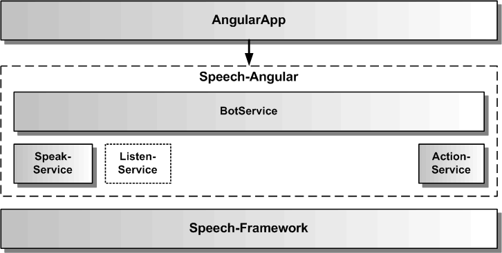

# Gesamtarchitektur des Speech-Angular SDKs

Die Speech-Angular Architektur umfasst verschiedene Services, die jeweils ein API für ein Feature des SDKs für die eigene AngularApp zur Verfügung stellen. Die gepunkteten Services sind momentan noch nicht implementiert. Das Speech-Angular SDK bindet zur Erbringung seiner Funktionalität das Speech-Framework ein.

Der [BotService](BotService.md) verwendet die anderen Services und kombiniert sie zu einer komplexen Dialogfunktionalität.
Der [SpeakService](SpeakService.md) dient zur Sprachausgabe von einzelnen Texten. Dazu verwendet er seinerseits entweder Sprachsynthese oder Audiodateien. Der [ActionService](ActionService.md) dient zur Weiterleitung von Aktionen aus dem Bot an konkrete Funktionen oder Komponenten der AngularApp. Die AngularApp kann jeden Service unabhängig von den anderen Services nutzen.  

