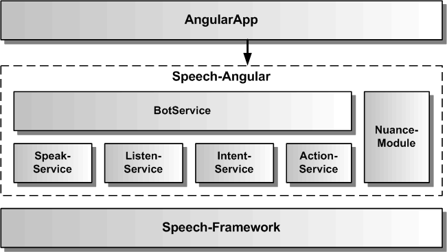

# Architektur des Speech-Angular SDKs

Die Speech-Angular SDK Architektur umfasst verschiedene Services, die jeweils ein API für ein Feature des SDKs zur Verfügung stellen. Die grauen Services sind momentan noch nicht implementiert. Das Speech-Angular SDK bindet zur Erbringung seiner Funktionalität das Speech-Framework ein.

Der [BotService](BotService.md) verwendet die anderen Services und kombiniert sie zu einer komplexen Dialogfunktionalität.
Der [SpeakService](SpeakService.md) dient zur Sprachausgabe von einzelnen Texten. Dazu verwendet er seinerseits entweder Sprachsynthese oder Audiodateien. Der [ActionService](ActionService.md) dient zur Weiterleitung von Aktionen aus dem Bot an konkrete Funktionen oder Komponenten der Angular-WebApp.   

