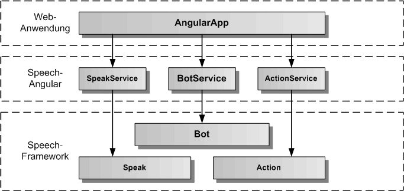
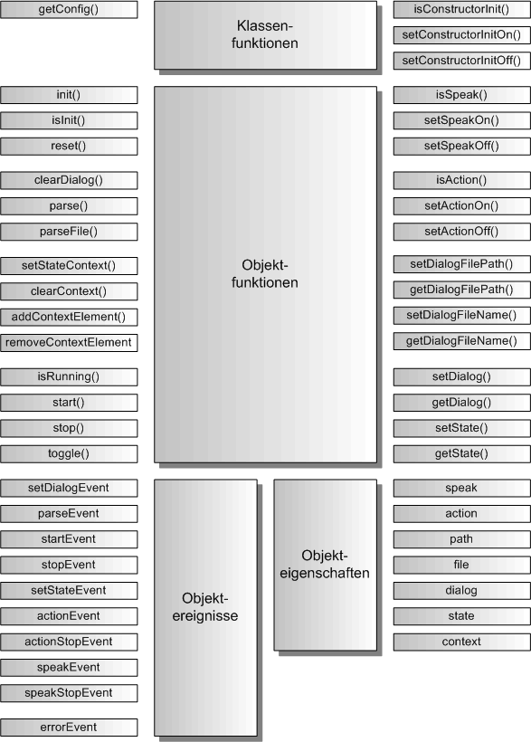

# BotService

Der BotService dient zum Abspielen von Dialogzuständen, die in einem Speech.def Skript abgelegt sind. Die Dialogzustände werden durch die AngularApp gesetzt. Mit Hilfe der [Dialog-Definitionssprache](./DialogScript.md) lassen sich komplexe Dialoge definieren. Der BotService liefert Ereignisse an die AngularApp zurück.

## Architektur

In der folgenden Grafik werden die einzelnen Schichten, angefangen von der AngularApp, über den BotService von Speech-Angular, bis zur Bot-Komponente, Speak-Komponente und Action-Komponente des Speech-Frameworks, dargestellt. Die Bot-Komponente nutzt ihrerseits die Speak- und Action-Komponenten, um die Sprachausgabe und die Aktionsverarbeitung auszuführen. Auf diese Komponenten kann die AngularApp über den [SpeakService](./SpeakService.md) und den [ActionService](./ActionService.md) auch direkt zugreifen.  

## API

Der BotService definiert die öffentliche Schnittstelle von Speech-Angular für die Dialogausführung. Die folgende Grafik zeigt einen Überblick über die gesamte API des BotServices. Die API teilt sich auf in statische Klassenfunktionen, Objektfunktionen, Objektereignisse und Objekteigenschaften. Die API verfügt über eine auf Funktionen und eine auf Eigenschaften basierende Schnittstelle. Die gleiche Aufgabe kann über Funktionsaufrufe oder über das Setzen von Eigenschaften erledigt werden. Z.B. kann der Dialogname entweder mit botService.setDialog('TestDialog') oder mit botService.dialog = 'TestDialog' eingetragen werden, bevor mit botService.start() die Dialogausführung gestartet wird.

Die statischen Klassenfunktionen dienen der Konfiguration des BotService vor seiner Erzeugung, sowie der Festlegung, ob die init()-Funktion im Konstruktor von BotService bereits aufgerufen wird oder nicht. Dazu werden die Klassenfunktionen mit dem Klassennamen BotService aufgerufen, wie z.B. die Rückgabe der Konfiguration mit BotService.getConfig().
Die Objektereignisse geben Angular-EventEmitter zurück, diese sollten mit subscribe aufgerufen werden und die Rückgabe sollte in einer Variablen für den Aufruf von unsubscribe gespeichert werden:

	// Setzen einer Ereignisfunktion mit subscribe
	const errorEvent = botService.errorEvent.subscribe( aError => console.log('Fehlerausgabe:', aError.message));
	...
	// Freigabe der Ereignisfunktion mit unsubscribe
	errorEvent.unsubscribe();

## Importieren

Um den BotService importieren zu können, muss in der jeweiligen Komponente folgende Zeile eingefügt werden:

	import { BotService } from 'speech-angular'
	
Dazu muss das Speech-Angular npm-Paket vorher ins eigene AngularApp-Projekt kopiert und installiert worden sein.

	$ npm install --save speech-angular-<version>.tgz
	 

## Konfiguration

Dier erste Aufgabe vor Nutzung des BotService besteht in der Festlegung der Konfiguration vor der Erzeugung des Services in Angular. In der Defaulteinstellung wird die init()-Funktion im Konstruktor aufgerufen und die voreingestellte Konfiguration übernommen. Will man die Defaultkonfiguration überschreiben, holt man sie sich mittels der Klassenfunktion BotService.getConfig(). Diese Funktion gibt das BotConfig-Objekt des BotServices zurück. 

Auszug aus der Datei: src/speech/bot/bot-service-config.ts:

	// hier sind die Defaultwerte des BotService festgelegt	
	export const BotServiceConfig: BotServiceOptionInterface = {
	    /** ein/ausschalten des Bot */
	    activeFlag: true,
	    /** ein/ausschalten der Sprachausgabe */
	    speakFlag: true,
	    /** ein/ausschalten der Aktionsverarbeitung */
	    actionFlag: true,
	    /** einzustellender Startdialog */
	    dialogName: 'main',
	    /** Startdialogzustand, wenn ein Dialog gestartet wird */
	    dialogRootState: 'home',
	    /** legt fest, ob ein Dialog direkt geladen wird */
	    dialogLoadFlag: true,
	    /** definiert das Verzeichnis fuer die Dialogdefinitionsdateien */
	    dialogFilePath: 'assets/',
	    /** Dialogdefinitionsdateiname fuer die erste zu ladende Dialogdefinitonsdatei */
	    dialogFileName: 'speech.def',
	    /** legt fest, ob die Fehlermeldungen zusaetzlich auf der Konsole ausgegeben werden */
	    errorOutputFlag: false
	};

Die Konfiguration kann man nur in app.module.ts vornehmen, da sie vor der Erzeugung des BotService stattfinden muss.

Auszug aus der Datei: src/app/app.module.ts:

	import { BrowserModule } from '@angular/platform-browser';
	import { NgModule } from '@angular/core';
	
	import { AppComponent } from './app.component';
	
	// BotService
	
	import { BotService } from 'speech-angular';
	
	
	@NgModule({
	  declarations: [
	    AppComponent
	  ],
	  imports: [
	    BrowserModule
	  ],
	  providers: [BotService],
	  bootstrap: [AppComponent]
	})
	export class AppModule {
		
		// nur hier kann die BotService-Konfiguration geaendert werden
		constructor() {
			// BotService-Konfiguration holen
			const botServiceConfig = BotService.getConfig();
			// hier kann man alle Konfigurationswerte aendern, diese werden bei der Initialsierung uebernommen
			// es muessen nur die von den Defaultwerten abweichenden Werte eingetragen werden
			botServiceConfig.dialogName = 'StartDialog';
			botServiceConfig.dialogRootState = 'ErsterState';
			botServiceConfig.dialogFilePath = 'assets/speech/';
			speakServiceConfig.errorOutputFlag = true;
		}
	
	}

Soll die init()-Funktion manuell nach der Erzeugung des BotService aufgerufen werden, so muss im AppModule-Konstruktor die Klassenfunktion BotService.setConstructorInitOff() aufgerufen werden. Damit schaltet man den Aufruf von init() im BotService-Konstruktor aus.

Auszug aus der Datei: src/app/app.module.ts:

	... 
	export class AppModule {
		
		// nur hier kann die BotService-Konfiguration geaendert werden, da der Konstruktor von BotService
		// noch nicht aufgerufen worden ist
		constructor() {
			BotService.setConstructorInitOff();
		}
	
	}

Die init()-Funktion kann man dann zu einem beliebig späteren Zeitpunkt z.B. in der AppComponent mit eigenen optionalen Parametern aufrufen.

Auszug aus der Datei: src/app/app.component.ts:

	import { Component, OnInit } from '@angular/core';
	
	// BotService
	
	import { BotService } from 'speech-angular';
	
	// App-Komponente
	
	@Component({
		selector: 'app-root',
		templateUrl: './app.component.html',
		styleUrls: ['./app.component.css']
	})
	export class AppComponent implements OnInit {
	
	  title = 'Speech-Angular-App';
	
	  constructor( private botService: BotService ) {}
	
		ngOnInit(): void {
			// Hier wird der BotService manuell mit optionalen Parametern initialisiert
	  		this.botService.init({ errorOutputFlag: true });
	  	}
	
	}

## Service ein/ausschalten 

Der BotService kann aktiviert und deaktiviert werden. Zu Beginn ist er defaultmäßig immer aktiviert, es sei denn, man hat in der Konfiguration das activeFlag auf false gesetzt. Für das Setzen auf aktiv ein/aus kann man die Funtionen botService.setActiveOn() und botService.setActiveOff() benutzen, oder man setzt die Eigenschaft botService.active auf true oder false. Ist der BotService aktiv, werden die Dialoge ausgeführt, ist der Service deaktiviert, werden global keine Dialoge ausgeführt. Prüfen kann man den Aktivzustand über botService.isActive()-Funktion oder man liest die Eigenschaft botService.active aus. 

	// BotService einschalten per Funktion
	botService.setActiveOn();
	// oder per Eigenschaft
	botService.active = true;
	
	// BotService ausschalten per Funktion
	botService.setActiveOff();
	// oder per Eigenschaft
	botService.active = false;
	
	// Abfrage auf aktiv per Funktion
	if ( botService.isActive()) { ... }
	// oder per Eigenschaft
	if ( botService.active ) { ... }
	
	

## Fehlerausgabe auf die Entwicklerkonsole

Bei der Integration des BotService ist es mitunter sinnvoll, seine Fehlerausgaben auf die Entwicklerkonsole sofort auszugeben, um die Ursache eines Problems schneller finden zu können. Dazu kann die Fehlerausgabe auf die Konsole ein- und ausgeschaltet werden. Mit den Funktionen botService.setErrorOutputOn() und botService.setErrorOutputOff() kann man die Fehlerausgabe ein- und ausschalten. Mit der botService.isErrorOutput()-Funktion kann man den Zustand für die Fehlerausgabe abfragen. Für das Setzen der Fehlerausgabe gibt es die Eigenschaft botService.errorOutput, in die man true oder false eintragen kann, die man aber auch auslesen kann. Das errorOutputFlag kann auch in der Konfiguration gesetzt werden.  

	// Fehlerausgabe einschalten per Funktion
	botService.setErrorOutputOn();
	// oder per Eigenschaft
	botService.errorOutput = true;
	
	// Fehlerausgabe ausschalten per Funktion
	botService.setErrorOutputOff();
	// oder per Eigenschaft
	botService.errorOutput = false;
	
	// Abfrage auf Fehlerausgabe per Funktion
	if ( botService.isErrorOutput()) { ... }
	// oder per Eigenschaft
	if ( botService.errorOutput ) { ... }

## Dialogdatei einlesen

Bevor ein Dialog ausgeführt werden kann, muss die zugehörige Dialogskiptdatei erstellt und eingelesen werden. Wie eine Dialogskriptdatei erstellt wird, kann [hier](./DialogScript.md) nachgelesen werden. Hier beschäftigen wir uns mit den verschiedenen Möglichkeiten, eine Dialogskriptdatei einzulesen. Die erste Möglichkeit ist, die Dialogskriptdatei bei der Initialisierung des BotService einzulesen. Dies ist in der Konfiguration defaultmäßig durch Setzen des dialogLoadFlag auf true eingestellt. Daneben müssen aber auch das Dialogverzeichnis und die Dialogdatei richtig gesetzt sein. Nimmt man hier nicht die Defaulteinstellungen von dialogFilePath = 'assets/' und dialogFileName = 'speech.def' so muss man die Parameter in der Konfiguration selbst setzen, wie unter dem Abschnitt Konfiguration weiter oben beschrieben. Will man das Dialogskript komplett selbst verwalten kann man den Parameter dialogLoadFlag in der Konfiguration auf false setzen und die Dialogskriptdatei mit der parseFile()-Funktion einlesen. Alternativ kann man das Dialogskript als String im Code einfügen und über die parse()-Funktion einlesen. Ist das Dialogskript erfolgreich eingelesen worden, wird ein parseEvent ausgelöst. Bei einem Fehler wird ein errorEvent ausgelöst.

Beispielkomponente zum manuellen Einlesen einer Dialogskriptdatei:
 
	import { Component, OnInit, OnDestroy } from '@angular/core';

	// BotService 
		
	import { BotService } from 'speech-angular';

	
	@Component({
		selector: 'app-bot',
		templateUrl: './bot.component.html',
		styleUrls: ['./bot.component.css']
	})
	export class SpeakComponent implements OnInit, OnDestroy {
	
		botParseEvent = null;
		botErrorEvent = null;
	
		constructor( private botService: BotService ) {}
		
		// Bot-Ereignisse eintragen
				
		ngOnInit() {
			this.botParseEvent = speakService.errorEvent.subscribe(aError => console.log('Dialogskript komplett eingelesen'));
			this.botErrorEvent = speakService.errorEvent.subscribe(aError => console.log('Fehler:', aError.message));
		}

		// Bot-Ereignisse freigeben
		
		ngOnDestroy() {
			this.botParseEvent.unsubscribe();
			this.botErrorEvent.unsubscribe();
		}

		// eigene Funktionen fuer das parsen eines Dialogskriptes in einer eigenen Angular-Komponente

		parse() {
			// wird kein eigener Dateiname als optionaler Parameter uebergeben, wird der Defaultname verwendet
			this.botService.parseFile();
		}

	}

## Dialog ausführen

Um einen Dialog auszuführen zu können, müssen zuerst der DialogName und dann der StatusName gesetzt werden.
Diese Namen müssen mit Namen aus dem aktuell eingelesenem Dialogskript übereinstimmen. Wird der Dialog gestartet, wird ein startEvent ausgelöst, wird der Dialog beendet wird ein stopEvent ausgelöst. Für jede Aktion und jede Sprachausgabe werden ebenfalls entsprechende Ereignisse ausgelöst.

Beispiel-Komponente für das ausführen eines Dialogs:

	import { Component, OnInit, OnDestroy } from '@angular/core';

	// BotService 
		
	import { BotService } from 'speech-angular';

	
	@Component({
		selector: 'app-bot',
		templateUrl: './bot.component.html',
		styleUrls: ['./bot.component.css']
	})
	export class BotComponent implements OnInit, OnDestroy {
	
		botStartEvent = null;
		botStopEvent = null;
		botErrorEvent = null;
	
		constructor( private botService: BotService ) {}
		
		// Bot-Ereignisse eintragen
				
		ngOnInit() {
			this.botStartEvent = speakService.startEvent.subscribe(() => console.log('Dialog gestartet'));
			this.botStopEvent = speakService.stopEvent.subscribe(() => console.log('Dialog beendet'));
			this.botErrorEvent = speakService.errorEvent.subscribe(aError => console.log('Dialog Fehler:', aError.message));
		}

		// Bot-Ereignisse freigeben
		
		ngOnDestroy() {
			this.botStartEvent.unsubscribe();
			this.botStopEvent.unsubscribe();
			this.botErrorEvent.unsubscribe();
		}

		// eigene Funktionen fuer die Dialogausfuehrung in einer eigenen Angular-Komponente

		dialog( aDialog: string, aState: string ) {
			this.botService.dialog = aDialog;
			this.botService.state = aState;
			this.botService.start();
		}
		
		dialogStop() {
			this.botService.stop();
		}

	}

## Sprachausgabe ein/ausschalten

Möchte man einen Dialog ohne Sprachausgabe ausführen, kann man die Sprachausgabe für den Bot ausschalten. Dies kann sowohl in der Konfiguration über den Parameter speakFlag gesetzt werden oder über die Speak-Funktionen/Eigenschaft.

	// Sprachausgabe einschalten per Funktion
	botService.setSpeakOn();
	// oder per Eigenschaft
	botService.speak = true;
	
	// Sprachausgabe ausschalten per Funktion
	botService.setSpeakOff();
	// oder per Eigenschaft
	botService.speak = false;
	
	// Abfrage auf Sprachausgabe per Funktion
	if ( botService.isSpeak()) { ... }
	// oder per Eigenschaft
	if ( botService.speak ) { ... }

## Aktionsverarbeitung ein/ausschalten

Möchte man einen Dialog ohne Aktionsverarbeitung ausführen, kann man die Aktionsverarbeitung für den Bot ausschalten. Dies kann sowohl in der Konfiguration über den Parameter actionFlag gesetzt werden oder über die Action-Funktionen/Eigenschaft.

	// Aktionsverarbeitung einschalten per Funktion
	botService.setActionOn();
	// oder per Eigenschaft
	botService.action = true;
	
	// Aktionsverarbeitung ausschalten per Funktion
	botService.setActionOff();
	// oder per Eigenschaft
	botService.action = false;
	
	// Abfrage auf Aktionsverarbeitung per Funktion
	if ( botService.isAction()) { ... }
	// oder per Eigenschaft
	if ( botService.action ) { ... }
