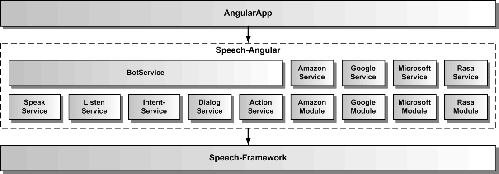

# Gesamtarchitektur des Speech-Angular SDKs

Die Speech-Angular Architektur umfasst verschiedene Services, die jeweils ein API für ein Feature des SDKs für die eigene AngularApp zur Verfügung stellen. Das Speech-Angular SDK bindet zur Erbringung seiner Funktionalität das Speech-Framework ein.

## Services

Der BotService verwendet die anderen Services und kombiniert sie zu einer komplexen Dialogfunktionalität.
Der SpeakService dient zur Sprachausgabe von einzelnen Texten. Dazu verwendet er seinerseits entweder Sprachsynthese oder Audiodateien. Der ListenService dient zur Spracheingabe. Dazu verwendet er seinerseits Spracherkennung. Der IntentService dient zur Sprachanalyse von Texten, um deren Intention herauszufinden. Für die Sprachanalyse wird eine NLU mit einem Sprachmodell benötigt. Je nach verwendeter NLU, ob lokal oder cloudbasiert, muss das Sprachmodell über eine Web-Anwendung beim NLU-Anbieter für die eigene App erstellt werden. Zusätzlich benötigt man einen Account beim NLU-Anbieter.
Der ActionService dient zur Weiterleitung von Aktionen aus dem Bot an konkrete Funktionen oder Komponenten der AngularApp. Der NuanceService erlaubt die Änderung der Nuance-Credentials. Die AngularApp kann jeden Service unabhängig von den anderen Services nutzen. [Hier](./../service/Service.md) werden alle Services beschrieben.

## Module

Neben den Services, die direkt in Angular eingebunden werden, gibt es auch noch Module, die Speech-Angular um spezielle Funktionalität ergänzen. Dazu gehört das NuanceModule welches den Nuance Cloud-Dienst in Speech-Angular einbindet, und in den Services für Speak (Nuance-TTS), Listen (Nuance-ASR) und Intent (Nuance-NLU) verfügbar macht. [Hier](./../cloud/Cloud.md) werden die eingebundenen Cloud-Dienste beschrieben.
