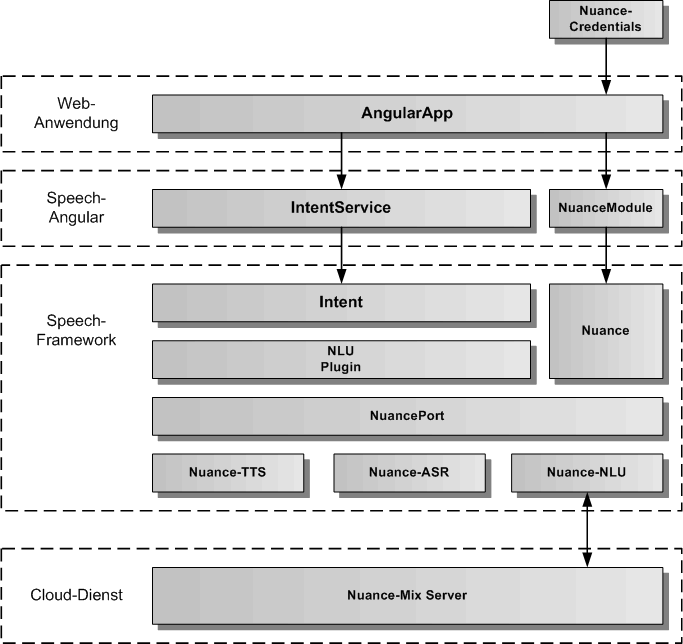
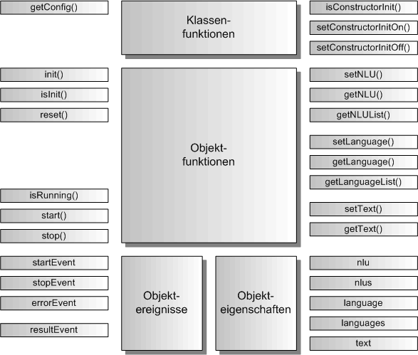

# IntentService

Der IntentService dient zur Sprachanalyse von Texten zur Erzeugung eines Intents. Für die Sprachanalyse wird die NLU des Nuance Cloud-Dienstes verwendet. Der gesamte Code läuft komplett im Browser und verbindet sich per WebSocket mit dem Nuance Cloud-Dienst.

## Architektur

In der folgenden Grafik werden die einzelnen Schichten, angefangen von der AngularApp, über den IntentService und das NuanceModule von Speech-Angular, die Intent-Komponente, das Plugin für die NLU (Natural Language Understanding), sowie die verschiedenen Nuance-Komponenten im Speech-Framework, bis hinunter zum Nuance Cloud-Dienst, dargestellt. 

Ganz oben sind die für den IntentService notwendigen Nuance-Credentials dargestellt, die der AngularApp übergeben werden müssen. Eine Anleitung für die Erstellung der Nuance-Credentials und die Einbindung des NuanceModule in die AngularApp zur Aktivierung des Nuance Cloud-Service findet man unter [docs/cloud/Nuance.md](./../cloud/Nuance.md)

## API

Der IntentService definiert die öffentliche Schnittstelle von Speech-Angular für die Sprachanalyse. Die folgende Grafik zeigt einen Überblick über die gesamte API des IntentServices. Die API teilt sich auf in statische Klassenfunktionen, Objektfunktionen, Objektereignisse und Objekteigenschaften. Die API verfügt über eine auf Funktionen und eine auf Eigenschaften basierende Schnittstelle. Die gleiche Aufgabe kann über Funktionsaufrufe oder über das Setzen von Eigenschaften erledigt werden. Z.B. kann die Sprache entweder mit intentService.setLanguage('de') oder mit intentService.language = 'de' eingetragen werden, bevor mit intentService.start() die Sprachanalyse gestartet wird.

Die statischen Klassenfunktionen dienen der Konfiguration des IntentService vor seiner Erzeugung, sowie der Festlegung, ob die init()-Funktion im Konstruktor von IntentService bereits aufgerufen wird oder nicht. Dazu werden die Klassenfunktionen mit dem Klassennamen IntentService aufgerufen, wie z.B. die Rückgabe der Konfiguration mit IntentService.getConfig().
Die Objektereignisse geben Angular-EventEmitter zurück, diese sollten mit subscribe aufgerufen werden und die Rückgabe sollte in einer Variablen für den Aufruf von unsubscribe gespeichert werden:

	// Setzen einer Ereignisfunktion mit subscribe
	const errorEvent = intentService.errorEvent.subscribe( aError => console.log('Fehlerausgabe:', aError.message));
	...
	// Freigabe der Ereignisfunktion mit unsubscribe
	errorEvent.unsubscribe();

## Importieren

Um den IntentService importieren zu können, muss in der jeweiligen Komponente folgende Zeile eingefügt werden:

	import { IntentService } from 'speech-angular'
	
Dazu muss das Speech-Angular npm-Paket vorher ins eigene AngularApp-Projekt kopiert und installiert worden sein.

	$ npm install --save speech-angular-<version>.tgz
	 

## Konfiguration

Dier erste Aufgabe vor Nutzung des IntentService besteht in der Festlegung der Konfiguration vor der Erzeugung des Services in Angular. In der Defaulteinstellung wird die init()-Funktion im Konstruktor aufgerufen und die voreingestellte Konfiguration übernommen. Will man die Defaultkonfiguration überschreiben, holt man sie sich mittels der Klassenfunktion IntentService.getConfig(). Diese Funktion gibt das IntentConfig-Objekt des IntentServices zurück. 

Auszug aus der Datei: src/speech/intent/intent-service-config.ts:

	// hier sind die Defaultwerte des IntentService festgelegt	
	export const IntentServiceConfig: IntentServiceOptionInterface = {
	    /** ein/ausschalten der Intent-Komponente */
	    activeFlag: true,
	    /** setzt die Sprache fuer die Sprachanalyse ( 'de', 'en' )*/
	    intentLanguage: 'de',
	    /** legt fest, ob die Fehlermeldungen zusaetzlich auf der Konsole ausgegeben werden */
	    errorOutputFlag: false
	};

Die Konfiguration kann man nur in app.module.ts vornehmen, da sie vor der Erzeugung des IntentService stattfinden muss.

Auszug aus der Datei: src/app/app.module.ts:

	import { BrowserModule } from '@angular/platform-browser';
	import { NgModule } from '@angular/core';
	
	import { AppComponent } from './app.component';
	
	// IntentService
	
	import { IntentService } from 'speech-angular';
	
	
	@NgModule({
	  declarations: [
	    AppComponent
	  ],
	  imports: [
	    BrowserModule
	  ],
	  providers: [IntentService],
	  bootstrap: [AppComponent]
	})
	export class AppModule {
		
		// nur hier kann die IntentService-Konfiguration geaendert werden
		constructor() {
			// IntentService-Konfiguration holen
			const intentServiceConfig = IntentService.getConfig();
			// hier kann man alle Konfigurationswerte aendern, diese werden bei der Initialsierung uebernommen
			// es muessen nur die von den Defaultwerten abweichenden Werte eingetragen werden
			intentServiceConfig.intentLanguage = 'en';
			intentServiceConfig.errorOutputFlag = true;
		}
	
	}

Soll die init()-Funktion manuell nach der Erzeugung des IntentService aufgerufen werden, so muss im AppModule-Konstruktor die Klassenfunktion IntentService.setConstructorInitOff() aufgerufen werden. Damit schaltet man den Aufruf von init() im IntentService-Konstruktor aus.

Auszug aus der Datei: src/app/app.module.ts:

	... 
	export class AppModule {
		
		// nur hier kann die IntentService-Konfiguration geaendert werden, da der Konstruktor von IntentService
		// noch nicht aufgerufen worden ist
		constructor() {
			IntentService.setConstructorInitOff();
		}
	
	}

Die init()-Funktion kann man dann zu einem beliebig späteren Zeitpunkt z.B. in der AppComponent mit eigenen optionalen Parametern aufrufen.

Auszug aus der Datei: src/app/app.component.ts:

	import { Component, OnInit } from '@angular/core';
	
	// IntentService
	
	import { IntentService } from 'speech-angular';
	
	// App-Komponente
	
	@Component({
		selector: 'app-root',
		templateUrl: './app.component.html',
		styleUrls: ['./app.component.css']
	})
	export class AppComponent implements OnInit {
	
	  title = 'Speech-Angular-App';
	
	  constructor( private intentService: IntentService ) {}
	
		ngOnInit(): void {
			// Hier wird der IntentService manuell mit optionalen Parametern initialisiert
	  		this.intentService.init({ intentLanguage: 'en', errorOutputFlag: true });
	  	}
	
	}

## Service ein/ausschalten 

Der IntentService kann aktiviert und deaktiviert werden. Zu Beginn ist er defaultmäßig immer aktiviert, es sei denn, man hat in der Konfiguration das activeFlag auf false gesetzt. Für das Setzen auf aktiv ein/aus kann man die Funtionen intentService.setActiveOn() und intentService.setActiveOff() benutzen, oder man setzt die Eigenschaft intentService.active auf true oder false. Ist der IntentService aktiv, werden alle Sprachanalysen durchgeführt, ist der Service deaktiviert, werden global keine Sprachanalysen getätigt. Prüfen kann man den Aktivzustand über intentService.isActive()-Funktion oder man liest die Eigenschaft intentService.active aus. 

	// IntentService einschalten per Funktion
	intentService.setActiveOn();
	// oder per Eigenschaft
	intentService.active = true;
	
	// IntentService ausschalten per Funktion
	intentService.setActiveOff();
	// oder per Eigenschaft
	intentService.active = false;
	
	// Abfrage auf aktiv per Funktion
	if ( intentService.isActive()) { ... }
	// oder per Eigenschaft
	if ( intentService.active ) { ... }
	
Sollte sich der IntentService nicht aktivieren lassen, obwohl man intentService.active = true gesetzt hat, ist keine Sprachanalyse im Browser vorhanden. Entweder das NuanceModule wurde nicht in die AngularApp eingebunden, oder die Nuance-Credentials sind ungueltig. Vor Nutzung des IntentService sollte man immer pruefen, ob der IntentService auch aktiv ist.
	

## Fehlerausgabe auf die Entwicklerkonsole

Bei der Integration des IntentService ist es mitunter sinnvoll, seine Fehlerausgaben auf die Entwicklerkonsole sofort auszugeben, um die Ursache eines Problems schneller finden zu können. Dazu kann die Fehlerausgabe auf die Konsole ein- und ausgeschaltet werden. Mit den Funktionen intentService.setErrorOutputOn() und intentService.setErrorOutputOff() kann man die Fehlerausgabe ein- und ausschalten. Mit der intentService.isErrorOutput()-Funktion kann man den Zustand für die Fehlerausgabe abfragen. Für das Setzen der Fehlerausgabe gibt es die Eigenschaft intentService.errorOutput, in die man true oder false eintragen kann, die man aber auch auslesen kann. Das errorOutputFlag kann auch in der Konfiguration gesetzt werden.  

	// Fehlerausgabe einschalten per Funktion
	intentService.setErrorOutputOn();
	// oder per Eigenschaft
	intentService.errorOutput = true;
	
	// Fehlerausgabe ausschalten per Funktion
	intentService.setErrorOutputOff();
	// oder per Eigenschaft
	intentService.errorOutput = false;
	
	// Abfrage auf Fehlerausgabe per Funktion
	if ( intentService.isErrorOutput()) { ... }
	// oder per Eigenschaft
	if ( intentService.errorOutput ) { ... }

## Sprachanalyse

Um Sprache zu analysieren, muss zuerst die Sprache festgelegt werden. Hier hat man die Wahl zwischen den Funktionen zum Eintragen der Werte, oder den Eigenschaften. Die Sprache kann auch in der Konfiguration mit dem Parameter intentLanguage eingetragen werden. Es gibt zwei Konstanten für die Sprache Deutsch ('de') und Englisch ('en'), die immer verwendet werden sollten, wenn man die Sprache eintragen will. Neben der Sprache muss auch der Text für die Sprachanaylse übergeben werden. Dies kann man entweder mit der Übergabe des Textes an die intentService.setText() Funktion oder mit der Zuweisung an intentService.text machen. Hat man diese Werte eingetragen kann man die Sprachanalyse mit intentService.start() beginnen und mit intentService.stop() abbrechen. Nach dem Start der Sprachanalyse erhält man das Ereignis resultEvent und die Sprachanalyse wird automatisch beendet. Das Ereignis resultEvent erhält die Intention und die Confidence für den übergebenen Text. Falls ein Fehler auftritt, erhält man das Ereignis errorEvent.

Beispiel-Komponente für die Integration von Sprache:

	import { Component, OnInit, OnDestroy } from '@angular/core';

	// IntentService 
		
	import { IntentService, INTENT_DE_LANGUAGE, INTENT_EN_LANGUAGE } from 'speech-angular';

	
	@Component({
		selector: 'app-listen',
		templateUrl: './intent.component.html',
		styleUrls: ['./intent.component.css']
	})
	export class IntentComponent implements OnInit, OnDestroy {
	
		intentResultEvent = null;
		intentErrorEvent = null;
	
		constructor( private intentService: IntentService ) {}
		
		// Intent-Ereignisse eintragen
				
		ngOnInit() {
			this.intentResultEvent = intentService.resultEvent.subscribe(aResultIntent => console.log('Sprachanalyse Intent:', aResultIntent.intent, aResultIntent.confidence));
			this.listenErrorEvent = listenService.errorEvent.subscribe(aError => console.log('Sprachanalyse Fehler:', aError.message));
		}

		// Intent-Ereignisse freigeben
		
		ngOnDestroy() {
			this.listenResultEvent.unsubscribe();
			this.listenErrorEvent.unsubscribe();
		}

		// eigene Funktionen fuer die Sprachanalyse in einer eigenen Angular-Komponente

		intentGerman( aText: string ): void {
			this.intentService.text = aText;
			this.intentService.language = INTENT_DE_LANGUAGE;
			this.intentService.start();
		}
		
		intentEnglish( aText: string ): void {
			this.intentService.text = aText;
			this.intentService.language = INTENT_EN_LANGUAGE;
			this.intentService.start();
		}	

		intentStop() {
			this.intentService.stop();
		}

	}

