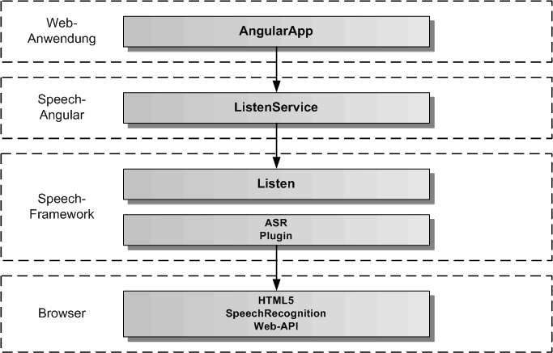
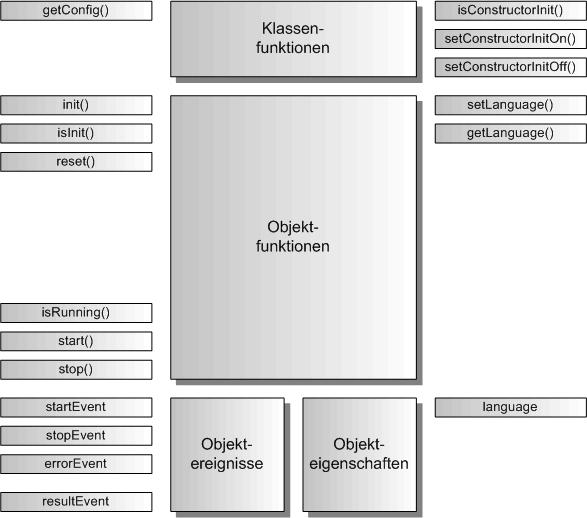

# ListenService

Der ListenService dient zur Spracherkennung von Texten. Für die Spracherkennung wird das HTML5 SpeechRecognition Web-API verwendet. Der gesamte Code läuft komplett im Browser.

## Architektur

In der folgenden Grafik werden die einzelnen Schichten, angefangen von der AngularApp, über den ListenService von Speech-Angular, die Listen-Komponente in Speech-Framework, das Plugin für ASR (Speech-to-Text), bis hinunter zur Standardschnittstelle des Browsers für SpeechRecognition, dargestellt. 

## API

Der ListenService definiert die öffentliche Schnittstelle von Speech-Angular für die Spracheingabe. Die folgende Grafik zeigt einen Überblick über die gesamte API des ListenServices. Die API teilt sich auf in statische Klassenfunktionen, Objektfunktionen, Objektereignisse und Objekteigenschaften. Die API verfügt über eine auf Funktionen und eine auf Eigenschaften basierende Schnittstelle. Die gleiche Aufgabe kann über Funktionsaufrufe oder über das Setzen von Eigenschaften erledigt werden. Z.B. kann die Sprache entweder mit listenService.setLanguage('de') oder mit listenService.language = 'de' eingetragen werden, bevor mit listenService.start() die Spracheingabe gestartet wird.

Die statischen Klassenfunktionen dienen der Konfiguration des ListenService vor seiner Erzeugung, sowie der Festlegung, ob die init()-Funktion im Konstruktor von ListenService bereits aufgerufen wird oder nicht. Dazu werden die Klassenfunktionen mit dem Klassennamen ListenService aufgerufen, wie z.B. die Rückgabe der Konfiguration mit ListenService.getConfig().
Die Objektereignisse geben Angular-EventEmitter zurück, diese sollten mit subscribe aufgerufen werden und die Rückgabe sollte in einer Variablen für den Aufruf von unsubscribe gespeichert werden:

	// Setzen einer Ereignisfunktion mit subscribe
	const errorEvent = listenService.errorEvent.subscribe( aError => console.log('Fehlerausgabe:', aError.message));
	...
	// Freigabe der Ereignisfunktion mit unsubscribe
	errorEvent.unsubscribe();

## Importieren

Um den ListenService importieren zu können, muss in der jeweiligen Komponente folgende Zeile eingefügt werden:

	import { ListenService } from 'speech-angular'
	
Dazu muss das Speech-Angular npm-Paket vorher ins eigene AngularApp-Projekt kopiert und installiert worden sein.

	$ npm install --save speech-angular-<version>.tgz
	 

## Konfiguration

Dier erste Aufgabe vor Nutzung des ListenService besteht in der Festlegung der Konfiguration vor der Erzeugung des Services in Angular. In der Defaulteinstellung wird die init()-Funktion im Konstruktor aufgerufen und die voreingestellte Konfiguration übernommen. Will man die Defaultkonfiguration überschreiben, holt man sie sich mittels der Klassenfunktion ListenService.getConfig(). Diese Funktion gibt das ListenConfig-Objekt des ListenServices zurück. 

Auszug aus der Datei: src/speech/listen/listen-service-config.ts:

	// hier sind die Defaultwerte des ListenService festgelegt	
	export const ListenServiceConfig: ListenServiceOptionInterface = {
	    /** ein/ausschalten der Listen-Komponente */
	    activeFlag: true,
	    /** setzt die Sprache fuer die Sprachausgabe ( 'de', 'en' )*/
	    listenLanguage: 'de',
	    /** legt fest, ob die Fehlermeldungen zusaetzlich auf der Konsole ausgegeben werden */
	    errorOutputFlag: false
	};

Die Konfiguration kann man nur in app.module.ts vornehmen, da sie vor der Erzeugung des ListenService stattfinden muss.

Auszug aus der Datei: src/app/app.module.ts:

	import { BrowserModule } from '@angular/platform-browser';
	import { NgModule } from '@angular/core';
	
	import { AppComponent } from './app.component';
	
	// ListenService
	
	import { ListenService } from 'speech-angular';
	
	
	@NgModule({
	  declarations: [
	    AppComponent
	  ],
	  imports: [
	    BrowserModule
	  ],
	  providers: [ListenService],
	  bootstrap: [AppComponent]
	})
	export class AppModule {
		
		// nur hier kann die ListenService-Konfiguration geaendert werden
		constructor() {
			// ListenService-Konfiguration holen
			const listenServiceConfig = ListenService.getConfig();
			// hier kann man alle Konfigurationswerte aendern, diese werden bei der Initialsierung uebernommen
			// es muessen nur die von den Defaultwerten abweichenden Werte eingetragen werden
			listenServiceConfig.listenLanguage = 'en';
			listenServiceConfig.errorOutputFlag = true;
		}
	
	}

Soll die init()-Funktion manuell nach der Erzeugung des ListenService aufgerufen werden, so muss im AppModule-Konstruktor die Klassenfunktion ListenService.setConstructorInitOff() aufgerufen werden. Damit schaltet man den Aufruf von init() im ListenService-Konstruktor aus.

Auszug aus der Datei: src/app/app.module.ts:

	... 
	export class AppModule {
		
		// nur hier kann die ListenService-Konfiguration geaendert werden, da der Konstruktor von ListenService
		// noch nicht aufgerufen worden ist
		constructor() {
			ListenService.setConstructorInitOff();
		}
	
	}

Die init()-Funktion kann man dann zu einem beliebig späteren Zeitpunkt z.B. in der AppComponent mit eigenen optionalen Parametern aufrufen.

Auszug aus der Datei: src/app/app.component.ts:

	import { Component, OnInit } from '@angular/core';
	
	// ListenService
	
	import { ListenService } from 'speech-angular';
	
	// App-Komponente
	
	@Component({
		selector: 'app-root',
		templateUrl: './app.component.html',
		styleUrls: ['./app.component.css']
	})
	export class AppComponent implements OnInit {
	
	  title = 'Speech-Angular-App';
	
	  constructor( private listenService: ListenService ) {}
	
		ngOnInit(): void {
			// Hier wird der ListenService manuell mit optionalen Parametern initialisiert
	  		this.listenService.init({ listenLanguage: 'en', errorOutputFlag: true });
	  	}
	
	}

## Service ein/ausschalten 

Der ListenService kann aktiviert und deaktiviert werden. Zu Beginn ist er defaultmäßig immer aktiviert, es sei denn, man hat in der Konfiguration das activeFlag auf false gesetzt. Für das Setzen auf aktiv ein/aus kann man die Funtionen listenService.setActiveOn() und listenService.setActiveOff() benutzen, oder man setzt die Eigenschaft listenService.active auf true oder false. Ist der ListenService aktiv, werden alle Spracheingaben durchgeführt, ist der Service deaktiviert, werden global keine Spracheingaben getätigt. Prüfen kann man den Aktivzustand über listenService.isActive()-Funktion oder man liest die Eigenschaft listenService.active aus. 

	// ListenService einschalten per Funktion
	listenService.setActiveOn();
	// oder per Eigenschaft
	listenService.active = true;
	
	// ListenService ausschalten per Funktion
	listenService.setActiveOff();
	// oder per Eigenschaft
	listenService.active = false;
	
	// Abfrage auf aktiv per Funktion
	if ( listenService.isActive()) { ... }
	// oder per Eigenschaft
	if ( listenService.active ) { ... }
	
Sollte sich der ListenService nicht aktivieren lassen, obwohl man listenService.active = true gesetzt hat, ist keine Spracherkennung im Browser vorhanden. Dies gilt bisher für alle Browser, außer Chrome. Daher lässt sich der ListenService nur in Chrome nutzen. Vor Nutzung des ListenService sollte man immer pruefen, ob der ListenService auch aktiv ist.
	

## Fehlerausgabe auf die Entwicklerkonsole

Bei der Integration des ListenService ist es mitunter sinnvoll, seine Fehlerausgaben auf die Entwicklerkonsole sofort auszugeben, um die Ursache eines Problems schneller finden zu können. Dazu kann die Fehlerausgabe auf die Konsole ein- und ausgeschaltet werden. Mit den Funktionen listenService.setErrorOutputOn() und listenService.setErrorOutputOff() kann man die Fehlerausgabe ein- und ausschalten. Mit der listenService.isErrorOutput()-Funktion kann man den Zustand für die Fehlerausgabe abfragen. Für das Setzen der Fehlerausgabe gibt es die Eigenschaft listenService.errorOutput, in die man true oder false eintragen kann, die man aber auch auslesen kann. Das errorOutputFlag kann auch in der Konfiguration gesetzt werden.  

	// Fehlerausgabe einschalten per Funktion
	listenService.setErrorOutputOn();
	// oder per Eigenschaft
	listenService.errorOutput = true;
	
	// Fehlerausgabe ausschalten per Funktion
	listenService.setErrorOutputOff();
	// oder per Eigenschaft
	listenService.errorOutput = false;
	
	// Abfrage auf Fehlerausgabe per Funktion
	if ( listenService.isErrorOutput()) { ... }
	// oder per Eigenschaft
	if ( listenService.errorOutput ) { ... }

## Spracheingabe

Um Sprache zu erfassen, muss zuerst die Sprache festgelegt werden. Hier hat man die Wahl zwischen den Funktionen zum Eintragen der Werte, oder den Eigenschaften. Die Sprache kann auch in der Konfiguration mit dem Parameter listenLanguage eingetragen werden. Es gibt zwei Konstanten für die Sprache Deutsch ('de') und Englisch ('en'), die immer verwendet werden sollten, wenn man die Sprache eintragen will. Hat man diese Werte eingetragen kann man die Spracheingabe mit listenService.start() beginnen und mit listenService.stop() wieder beenden. Der ListenService ist so eingestellt, das die Spracherfassung automatisch beendet wird, wenn nicht mehr gesprochen wird. Nach dem Start der Spracheingabe erhält man das Ereignis startEvent und nach dem Ende der Spracheingabe das Ereignis stopEvent. Falls ein Fehler auftritt, erhält man das Ereignis errorEvent. Das Ergebnis der Spracheingabe erhält man über das Ereignis resultEvent, bei dem der erkannte Text mit übergeben wird.

Beispiel-Komponente für die Integration von Sprache:

	import { Component, OnInit, OnDestroy } from '@angular/core';

	// ListenService 
		
	import { ListenService, LISTEN_DE_LANGUAGE, LISTEN_EN_ALANGUAGE } from 'speech-angular';

	
	@Component({
		selector: 'app-listen',
		templateUrl: './listen.component.html',
		styleUrls: ['./listen.component.css']
	})
	export class ListenComponent implements OnInit, OnDestroy {
	
		listenStartEvent = null;
		listenStopEvent = null;
		listenResultEvent = null;
		listenErrorEvent = null;
	
		constructor( private listenService: ListenService ) {}
		
		// Listen-Ereignisse eintragen
				
		ngOnInit() {
			this.listenStartEvent = listenService.startEvent.subscribe(() => console.log('Sprachausgabe gestartet'));
			this.listenStopEvent = listenService.stopEvent.subscribe(() => console.log('Sprachausgabe beendet'));
			this.listenResultEvent = listenService.resultEvent.subscribe(aResultText => console.log('Spracheingabe Ergebnistext:', aResultText));
			this.listenErrorEvent = listenService.errorEvent.subscribe(aError => console.log('Spracheingabe Fehler:', aError.message));
		}

		// Listen-Ereignisse freigeben
		
		ngOnDestroy() {
			this.listenStartEvent.unsubscribe();
			this.listenStopEvent.unsubscribe();
			this.listenResultEvent.unsubscribe();
			this.listenErrorEvent.unsubscribe();
		}

		// eigene Funktionen fuer die Spracheingabe in einer eigenen Angular-Komponente

		listenGerman() {
			this.listenService.language = LISTEN_DE_LANGUAGE;
			this.listenService.start();
		}
		
		listenEnglish()	{
			this.listenService.language = LISTEN_EN_LANGUAGE;
			this.listenService.start();
		}	

		listenStop() {
			this.listenService.stop();
		}

	}

