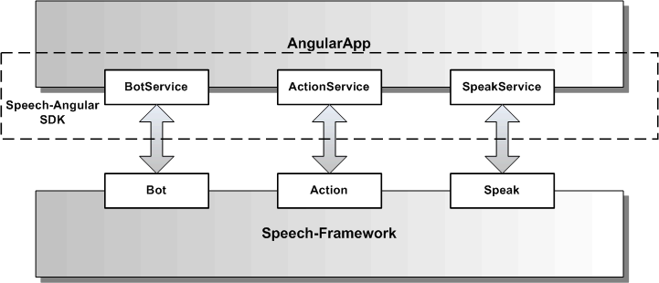

# Speech-Angular Services

Die Speech-Angular Services kapslen das Speech-Framework vollständig und definieren eine öffentliche API für eine AngularApp.

Die Services sind normale Angular-Services und integrieren sich nahtlos in die jeweilige AngularApp.

Die gemeinsame Grundfunktionalität aller Speech-Angular Services wird [hier](./Service.md) beschrieben.

Folgende Speech-Angular Services gibt es:

* [**BotService**](./BotService.md) 

* [**ActionService**](./ActionService.md)

* [**SpeakService**](./SpeakService.md)

* [**ListenService**](./ListenService.md)
