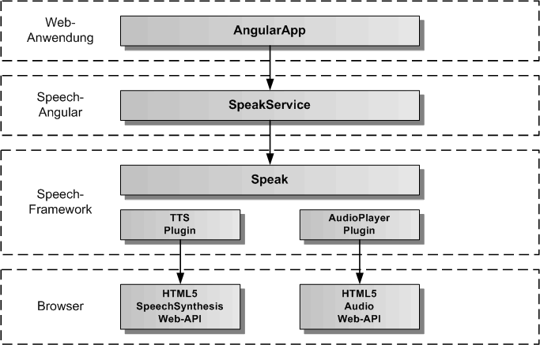
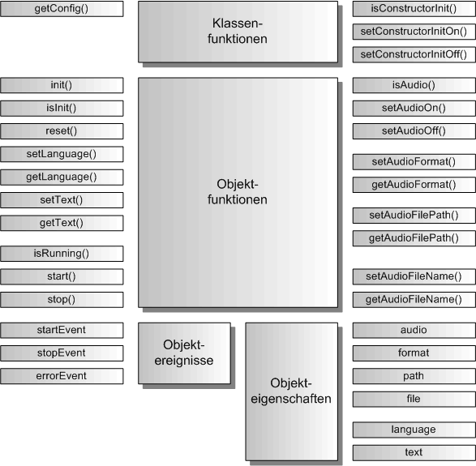

# SpeakService

Der SpeakService dient zur Sprachsynthese von Texten und zum Abspielen von Audiosprachdateien. Für die Sprachsynthese wird das HTML5 SpeechSynthesis Web-API verwendet. Für das Abspielen der Audiodateien wird das HTML5 Audio Web-API verwendet. Der gesamte Code läuft komplett im Browser.

## Architektur

In der folgenden Grafik werden die einzelnen Schichten, angefangen von der AngularApp, über den SpeakService von Speech-Angular, die Speak-Komponente in Speech-Framework, die Plugins für TTS (Text-to-Speech) und AudioPlayer, bis hinunter zu den Standardschnittstellen des Browsers für SpeechSynthesis und Audio, dargestellt. 

## API

Der SpeakService definiert die öffentliche Schnittstelle von Speech-Angular für die Sprachausgabe. Die folgende Grafik zeigt einen Überblick über die gesamte API des SpeakServices. Die API teilt sich auf in statische Klassenfunktionen, Objektfunktionen, Objektereignisse und Objekteigenschaften. Die API verfügt über eine auf Funktionen und eine auf Eigenschaften basierende Schnittstelle. Die gleiche Aufgabe kann über Funktionsaufrufe oder über das Setzen von Eigenschaften erledigt werden. Z.B. kann der zu sprechende Text entweder mit speakService.setText('Dies ist ein Text') oder mit speakService.text = 'Dies ist ein Text' eingetragen werden, bevor mit speakService.start() die Sprachausgabe gestartet wird.

Die statischen Klassenfunktionen dienen der Konfiguration des SpeakService vor seiner Erzeugung, sowie der Festlegung, ob die init()-Funktion im Konstruktor von SpeakService bereits aufgerufen wird oder nicht. Dazu werden die Klassenfunktionen mit dem Klassennamen SpeakService aufgerufen, wie z.B. die Rückgabe der Konfiguration mit SpeakService.getConfig().
Die Objektereignisse geben Angular-EventEmitter zurück, diese sollten mit subscribe aufgerufen werden und die Rückgabe sollte in einer Variablen für den Aufruf von unsubscribe gespeichert werden:

	// Setzen einer Ereignisfunktion mit subscribe
	const errorEvent = speakService.errorEvent.subscribe( aError => console.log('Fehlerausgabe:', aError.message));
	...
	// Freigabe der Ereignisfunktion mit unsubscribe
	errorEvent.unsubscribe();

## Importieren

Um den SpeakService importieren zu können, muss in der jeweiligen Komponente folgende Zeile eingefügt werden:

	import { SpeakService } from 'speech-angular'
	
Dazu muss das Speech-Angular npm-Paket vorher ins eigene AngularApp-Projekt kopiert und installiert worden sein.

	$ npm install --save speech-angular-<version>.tgz
	 

## Konfiguration

Dier erste Aufgabe vor Nutzung des SpeakService besteht in der Festlegung der Konfiguration vor der Erzeugung des Services in Angular. In der Defaulteinstellung wird die init()-Funktion im Konstruktor aufgerufen und die voreingestellte Konfiguration übernommen. Will man die Defaultkonfiguration überschreiben, holt man sie sich mittels der Klassenfunktion SpeakService.getConfig(). Diese Funktion gibt das SpeakConfig-Objekt des SpeakServices zurück. 

Auszug aus der Datei: src/speech/speak/speak-service-config.ts:

	// hier sind die Defaultwerte des SpeakService festgelegt	
	export const SpeakServiceConfig: SpeakServiceOptionInterface = {
	    /** ein/ausschalten der Speak-Komponente */
	    activeFlag: true,
	    /** setzt die Sprache fuer die Sprachausgabe ( 'de', 'en' )*/
	    speakLanguage: 'de',
	    /** Audioformat 'mp3' oder 'wav' */
	    audioFormat: 'mp3',
	    /** lokales Verzeichnis, in dem die Audiodateien liegen, z.B. 'assets/speech/audio/' */
	    audioFilePath: 'assets/',
	    /** True, wenn Audiodateien abgespielt werden sollen, anstelle der Sprachsynthese */
	    audioFlag: false,
	    /** legt fest, ob die Fehlermeldungen zusaetzlich auf der Konsole ausgegeben werden */
	    errorOutputFlag: false
	};

Die Konfiguration kann man nur in app.module.ts vornehmen, da sie vor der Erzeugung des SpeakService stattfinden muss.

Auszug aus der Datei: src/app/app.module.ts:

	import { BrowserModule } from '@angular/platform-browser';
	import { NgModule } from '@angular/core';
	
	import { AppComponent } from './app.component';
	
	// SpeakService
	
	import { SpeakService } from 'speech-angular';
	
	
	@NgModule({
	  declarations: [
	    AppComponent
	  ],
	  imports: [
	    BrowserModule
	  ],
	  providers: [SpeakService],
	  bootstrap: [AppComponent]
	})
	export class AppModule {
		
		// nur hier kann die SpeakService-Konfiguration geaendert werden
		constructor() {
			// SpeakService-Konfiguration holen
			const speakServiceConfig = SpeakService.getConfig();
			// hier kann man alle Konfigurationswerte aendern, diese werden bei der Initialsierung uebernommen
			// es muessen nur die von den Defaultwerten abweichenden Werte eingetragen werden
			speakServiceConfig.speakLanguage = 'en';
			speakServiceConfig.audioFormat = 'wav';
			speakServiceConfig.audioFilePath = 'assets/speech/audio/';
			speakServiceConfig.audioFlag = true;
			speakServiceConfig.errorOutputFlag = true;
		}
	
	}

Soll die init()-Funktion manuell nach der Erzeugung des SpeakService aufgerufen werden, so muss im AppModule-Konstruktor die Klassenfunktion SpeakService.setConstructorInitOff() aufgerufen werden. Damit schaltet man den Aufruf von init() im SpeakService-Konstruktor aus.

Auszug aus der Datei: src/app/app.module.ts:

	... 
	export class AppModule {
		
		// nur hier kann die SpeakService-Konfiguration geaendert werden, da der Konstruktor von SpeakService
		// noch nicht aufgerufen worden ist
		constructor() {
			SpeakService.setConstructorInitOff();
		}
	
	}

Die init()-Funktion kann man dann zu einem beliebig späteren Zeitpunkt z.B. in der AppComponent mit eigenen optionalen Parametern aufrufen.

Auszug aus der Datei: src/app/app.component.ts:

	import { Component, OnInit } from '@angular/core';
	
	// SpeakService
	
	import { SpeakService } from 'speech-angular';
	
	// App-Komponente
	
	@Component({
		selector: 'app-root',
		templateUrl: './app.component.html',
		styleUrls: ['./app.component.css']
	})
	export class AppComponent implements OnInit {
	
	  title = 'Speech-Angular-App';
	
	  constructor( private speakService: SpeakService ) {}
	
		ngOnInit(): void {
			// Hier wird der SpeakService manuell mit optionalen Parametern initialisiert
	  		this.speakService.init({ errorOutputFlag: true });
	  	}
	
	}

## Service ein/ausschalten 

Der SpeakService kann aktiviert und deaktiviert werden. Zu Beginn ist er defaultmäßig immer aktiviert, es sei denn, man hat in der Konfiguration das activeFlag auf false gesetzt. Für das Setzen auf aktiv ein/aus kann man die Funtionen speakService.setActiveOn() und speakService.setActiveOff() benutzen, oder man setzt die Eigenschaft speakService.active auf true oder false. Ist der SpeakService aktiv, werden alle Sprachausgaben durchgeführt, ist der Service deaktiviert, werden global keine Sprachausgaben getätigt. Prüfen kann man den Aktivzustand über speakService.isActive()-Funktion oder man liest die Eigenschaft speakService.active aus. 

	// SpeakService einschalten per Funktion
	speakService.setActiveOn();
	// oder per Eigenschaft
	speakService.active = true;
	
	// SpeakService ausschalten per Funktion
	speakService.setActiveOff();
	// oder per Eigenschaft
	speakService.active = false;
	
	// Abfrage auf aktiv per Funktion
	if ( speakService.isActive()) { ... }
	// oder per Eigenschaft
	if ( speakService.active ) { ... }
	
	

## Fehlerausgabe auf die Entwicklerkonsole

Bei der Integration des SpeakService ist es mitunter sinnvoll, seine Fehlerausgaben auf die Entwicklerkonsole sofort auszugeben, um die Ursache eines Problems schneller finden zu können. Dazu kann die Fehlerausgabe auf die Konsole ein- und ausgeschaltet werden. Mit den Funktionen speakService.setErrorOutputOn() und speakService.setErrorOutputOff() kann man die Fehlerausgabe ein- und ausschalten. Mit der speakService.isErrorOutput()-Funktion kann man den Zustand für die Fehlerausgabe abfragen. Für das Setzen der Fehlerausgabe gibt es die Eigenschaft speakService.errorOutput, in die man true oder false eintragen kann, die man aber auch auslesen kann. Das errorOutputFlag kann auch in der Konfiguration gesetzt werden.  

	// Fehlerausgabe einschalten per Funktion
	speakService.setErrorOutputOn();
	// oder per Eigenschaft
	speakService.errorOutput = true;
	
	// Fehlerausgabe ausschalten per Funktion
	speakService.setErrorOutputOff();
	// oder per Eigenschaft
	speakService.errorOutput = false;
	
	// Abfrage auf Fehlerausgabe per Funktion
	if ( speakService.isErrorOutput()) { ... }
	// oder per Eigenschaft
	if ( speakService.errorOutput ) { ... }

## Sprachausgabe

Um Sprache auszugeben, müssen zuerst die Sprache und dann der auszugebende Text festgelegt werden. Hier hat man die Wahl zwischen den Funktionen zum Eintragen der Werte, oder den Eigenschaften. Die Sprache kann auch in der Konfiguration mit dem Parameter speakLanguage eingetragen werden. Es gibt zwei Konstanten für die Sprache Deutsch ('de') und Englisch ('en'), die immer verwendet werden sollten, wenn man die Sprache eintragen will. Hat man diese Werte eingetragen kann man die Sprachausgabe mit speakService.start() beginnen und mit speakService.stop() wieder beenden. Alternativ kann man auch die Sprachausgabe sich selbst beenden lassen. Nach dem Start der Sprachausgabe erhält man das Ereignis startEvent und nach dem Ende der Sprachausgabe das Ereignis stopEvent. Falls ein Fehler auftritt, erhält man das Ereignis errorEvent.

Beispiel-Komponente für die Integration von Sprache:

	import { Component, OnInit, OnDestroy } from '@angular/core';

	// SpeakService 
		
	import { SpeakService, SPEAK_DE_LANGUAGE, SPEAK_EN_ALANGUAGE } from 'speech-angular';

	
	@Component({
		selector: 'app-speak',
		templateUrl: './speak.component.html',
		styleUrls: ['./speak.component.css']
	})
	export class SpeakComponent implements OnInit, OnDestroy {
	
		speakStartEvent = null;
		speakStopEvent = null;
		speakErrorEvent = null;
	
		constructor( private speakService: SpeakService ) {}
		
		// Speak-Ereignisse eintragen
				
		ngOnInit() {
			this.speakStartEvent = speakService.startEvent.subscribe(() => console.log('Sprachausgabe gestartet'));
			this.speakStopEvent = speakService.stopEvent.subscribe(() => console.log('Sprachausgabe beendet'));
			this.speakErrorEvent = speakService.errorEvent.subscribe(aError => console.log('Sprachausgabe Fehler:', aError.message));
		}

		// Speak-Ereignisse freigeben
		
		ngOnDestroy() {
			this.speakStartEvent.unsubscribe();
			this.speakStopEvent.unsubscribe();
			this.speakErrorEvent.unsubscribe();
		}

		// eigene Funktionen fuer die Sprachausgabe in einer eigenen Angular-Komponente

		speakGerman( aText: string ) {
			this.speakService.language = SPEAK_DE_LANGUAGE;
			this.speakService.text = aText;
			this.speakService.start();
		}
		
		speakEnglish( aText: string )	{
			this.speakService.language = SPEAK_EN_LANGUAGE;
			this.speakService.text = aText;
			this.speakService.start();
		}	

		speakStop() {
			this.speakService.stop();
		}

	}

## Audiowiedergabe

Die Audiowiedergabe verwendet vorgefertigte Audiosprachdateien für die Sprachausgabe. Dies kann verwendet werden, um eine AngularApp mit Sprachausgaben auszustatten, die keinen Zugriff auf die Sprachsynthese hat. Dies trifft vor allem für mobile Geräte zu. Ein weiterer Vorteil ist die Unabhängigkeit vom Internet, da die Audiodateien lokal in der AngularApp gespeichert werden können. Um Audiodateien abspielen zu können, muss der SpeakService zuerst in den Audiomodus umgeschaltet werden. Dies wird mit der Funktion speakService.setAudioOn() durchgeführt. Alternativ kann man auch die Audioeigenschaft verwenden und speakService.audio = true setzen. Der Audiomodus kann auch in der Konfiguration mit audioFlag auf true gesetzt werden. Neben dem Audiomodus müssen noch das Audiodateienformat, das Audiodateienverzeichnis und der Audiodateiname vor dem Abspielen einer Audiosprachdatei festgelegt werden. Das Audiodateiformat und das Audiodateiverzeichnis lassen sich über audioFormat und audioFilePath in der Konfiguration bereits setzen. Als Audioformat gibt es 'mp3' und 'wav'. Der Audiodateiname wird immer vor dem Abspielen der Audiosprachdatei eingetragen. 

Beispiel-Komponente für die Integration von Sprache:

	import { Component, OnInit, OnDestroy } from '@angular/core';

	// SpeakService 
		
	import { SpeakService, SPEAK_DE_LANGUAGE, SPEAK_EN_ALANGUAGE } from 'speech-angular';

	
	@Component({
		selector: 'app-speak',
		templateUrl: './speak.component.html',
		styleUrls: ['./speak.component.css']
	})
	export class SpeakComponent implements OnInit, OnDestroy {
	
		speakStartEvent = null;
		speakStopEvent = null;
		speakErrorEvent = null;
	
		constructor( private speakService: SpeakService ) {}
		
		// Speak-Ereignisse eintragen
				
		ngOnInit() {
			this.speakStartEvent = speakService.startEvent.subscribe(() => console.log('Sprachausgabe gestartet'));
			this.speakStopEvent = speakService.stopEvent.subscribe(() => console.log('Sprachausgabe beendet'));
			this.speakErrorEvent = speakService.errorEvent.subscribe(aError => console.log('Sprachausgabe Fehler:', aError.message));
			// setzen von Audiodateiformat und Audiodateiverzeichnis
			this.speakService.format = 'mp3';
			this.speakService.path = 'assets/speech/audio/';
			// setzen des Audiomodus
			this.speakService.audio = true;
		}

		// Speak-Ereignisse freigeben
		
		ngOnDestroy() {
			this.speakStartEvent.unsubscribe();
			this.speakStopEvent.unsubscribe();
			this.speakErrorEvent.unsubscribe();
			// loeschen des Audiomodus
			this.speakService.audio = false;
		}

		// eigene Funktionen fuer die Wiedergabe einer Audiosprachdatei in einer eigenen Angular-Komponente

		speakPlay( aFileName: string ) {
			this.speakService.file = aFileName;
			this.speakService.start();
		}
		
		speakStop() {
			this.speakService.stop();
		}

	}
