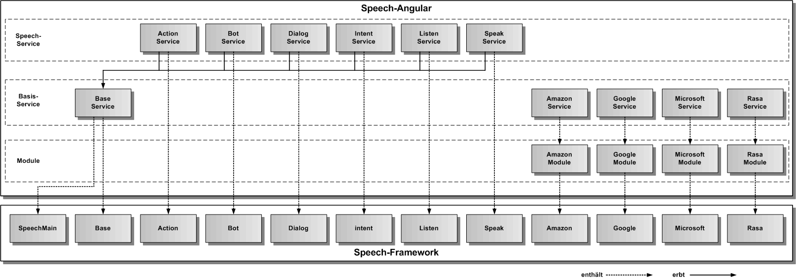

# Speech-Angular Services

Die Speech-Angular Services kapseln das Speech-Framework vollständig und definieren eine öffentliche Speech-Service API für eine Angular-App.

Die Speech-Services sind normale Angular-Services und integrieren sich nahtlos in die jeweilige Angular-App. Sie sind Service-Wrapperklassen für die gleichnamigen Speech-Framework Komponenten, wie in der oberen Grafik dargestellt.

In der folgenden Grafik werden die Vererbungsbeziehungen der Speech-Service Klassen zur BaseService-Klasse und die Enthaltensein-Beziehungen zu den Speech-Framework Komponenten dargestellt.

Die gemeinsame Grundfunktionalität aller Speech-Angular Services wird in [BaseService](./base/BaseService.md) implementiert.

Folgende Speech-Angular Services gibt es:

* [**ActionService**](./action/ActionService.md) - erlaubt die Fernsteuerung der Web-App über Aktionen

* [**BotService**](./bot/BotService.md) - erlaubt die Ausführung eines Dialogs über die [Dialog-Skriptsprache](./bot/DialogScript.md)

* [**IntentService**](./intent/IntentService.md) - erlaubt die Intentanalyse eines Textes

* [**ListenService**](./listen/ListenService.md) - erlaubt die Spracheingabe und Umwandlung in Text

* [**SpeakService**](./speak/SpeakService.md) - erlaubt die Sprachausgabe eines kurzen Textes

