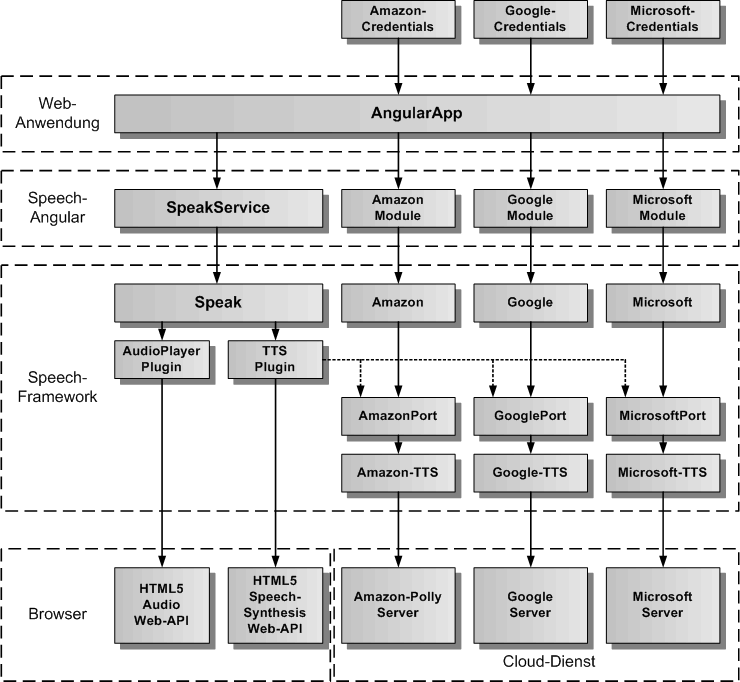
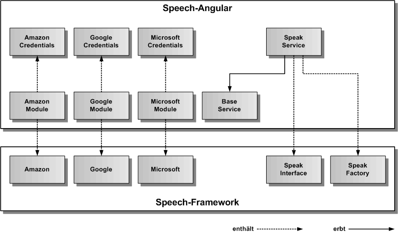
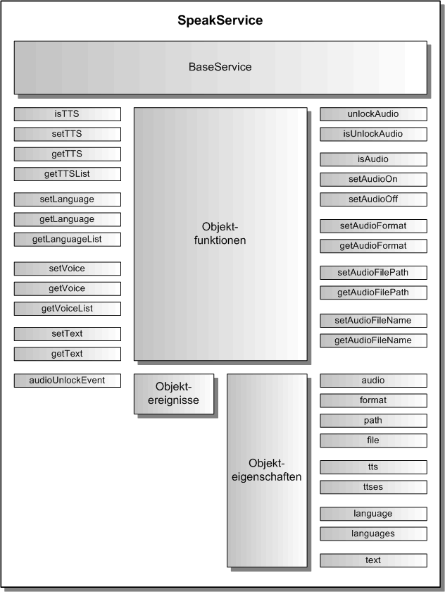

# SpeakService

Der SpeakService dient zur Sprachsynthese von Texten und zum Abspielen von Audiosprachdateien. Für die Sprachsynthese wird das HTML5 SpeechSynthesis Web-API verwendet. Es kann auch ein Cloud-Service verwendet werden. Für das Abspielen der Audiodateien wird das HTML5 Audio Web-API verwendet. Der gesamte Code läuft komplett im Browser. Der SpeakService erbt vom abstrakten [BaseService](./../base/BaseService.md).

## Architektur

In der folgenden Grafik werden die einzelnen Schichten, angefangen von der AngularApp, über den SpeakService von Speech-Angular, die Speak-Komponente in Speech-Framework, die Plugins für TTS (Text-to-Speech) und AudioPlayer, bis hinunter zu den Standardschnittstellen des Browsers für SpeechSynthesis und Audio, sowie den verschiedenen Cloud-Servern, dargestellt. 

Ganz oben sind die für den SpeakService notwendigen Credentials dargestellt, die der AngularApp übergeben werden müssen, wenn ein Cloud-Dienst als TTS zum Einsatz kommen soll. Eine Anleitung für die Erstellung der Credentials und die Einbindung des jeweiligen Cloud-Module in die AngularApp zur Aktivierung des Cloud-Service findet man unter [docs/cloud/Cloud.md](./../../cloud/Cloud.md)

Die nächste Grafik zeigt die konkrete Vererbungsbeziehung zu BaseService, sowie die Einbindung von SpeakFactory und SpeakInterface aus dem Speech-Framework. SpeakFactory ist eine statische Klasse und erzeugt das Speak-Objekt zum SpeakInterface. Auf der linken Seite sind die Cloud-Module dargestellt, welche als statische Klassen implementiert sind und das jeweilige Cloud-Singleton (Amazon, Google oder Microsoft) aus dem Speech-Framework einbindet.
Damit ein Cloud-Service funktioniert, müssen seine Credentials vom jeweiligen Cloud-Module an das Cloud-Singleton weitergereicht werden.

## API

Der SpeakService definiert die öffentliche Schnittstelle von Speech-Angular für die Sprachausgabe. Die folgende Grafik zeigt einen Überblick über die gesamte API des SpeakServices. Die API teilt sich auf in statische Klassenfunktionen, Objektfunktionen, Objektereignisse und Objekteigenschaften. Die API verfügt über eine auf Funktionen und eine auf Eigenschaften basierende Schnittstelle. Die gleiche Aufgabe kann über Funktionsaufrufe oder über das Setzen von Eigenschaften erledigt werden. Z.B. kann der zu sprechende Text entweder mit speakService.setText('Dies ist ein Text') oder mit speakService.text = 'Dies ist ein Text' eingetragen werden, bevor mit speakService.start() die Sprachausgabe gestartet wird.

## Importieren

Um den SpeakService importieren zu können, muss in der jeweiligen Komponente folgende Zeile eingefügt werden:

	import { SpeakService } from 'speech-angular'
	
Dazu müssen das Spech-Framework und das Speech-Angular npm-Paket in der gleichen Version vorher ins eigene AngularApp-Projekt kopiert und installiert worden sein.

	$ npm install speech-framework-<version>.tgz
	$ npm install speech-angular-<version>.tgz
	 
Alternativ kann man Speech-Angular aus dem globalen NPM-Repository installieren. Dann wird Speech-Framework automatisch mitinstalliert.

	$ npm install speech-angular	 

## Konfiguration

Dier erste Aufgabe vor Nutzung des SpeakService besteht in der Festlegung der Konfiguration vor der Erzeugung des Services in Angular. In der Defaulteinstellung wird die init()-Funktion im Konstruktor aufgerufen und die voreingestellte Konfiguration übernommen. Will man die Defaultkonfiguration überschreiben, holt man sie sich mittels der Klassenfunktion SpeakService.getConfig(). Diese Funktion gibt das SpeakConfig-Objekt des SpeakServices zurück. 

Auszug aus der Datei: src/speech/speak/speak-service-config.ts:

	// hier sind die Defaultwerte des SpeakService festgelegt	
	export const SpeakServiceConfig: SpeakServiceOptionInterface = {
	    /** ein/ausschalten der Speak-Komponente */
	    activeFlag: true,
	    /** setzt die Sprache fuer die Sprachausgabe ( 'de', 'en' )*/
	    speakLanguage: 'de',
	    /** Audioformat 'mp3' oder 'wav' */
	    audioFormat: 'mp3',
	    /** lokales Verzeichnis, in dem die Audiodateien liegen, z.B. 'assets/speech/audio/' */
	    audioFilePath: 'assets/',
	    /** True, wenn Audiodateien abgespielt werden sollen, anstelle der Sprachsynthese */
	    audioFlag: false,
	    /** legt fest, ob die Fehlermeldungen zusaetzlich auf der Konsole ausgegeben werden */
	    errorOutputFlag: false
	};

## Sprachausgabe

Um Sprache auszugeben, müssen zuerst die Sprache und dann der auszugebende Text festgelegt werden. Hier hat man die Wahl zwischen den Funktionen zum Eintragen der Werte, oder den Eigenschaften. Die Sprache kann auch in der Konfiguration mit dem Parameter speakLanguage eingetragen werden. Es gibt zwei Konstanten für die Sprache Deutsch ('de') und Englisch ('en'), die immer verwendet werden sollten, wenn man die Sprache eintragen will. Hat man diese Werte eingetragen kann man die Sprachausgabe mit speakService.start() beginnen und mit speakService.stop() wieder beenden. Alternativ kann man auch die Sprachausgabe sich selbst beenden lassen. Nach dem Start der Sprachausgabe erhält man das Ereignis startEvent und nach dem Ende der Sprachausgabe das Ereignis stopEvent. Falls ein Fehler auftritt, erhält man das Ereignis errorEvent.

Beispiel-Komponente für die Integration von Sprache:

	import { Component, OnInit, OnDestroy } from '@angular/core';

	// SpeakService 
		
	import { SpeakService, SPEAK_DE_LANGUAGE, SPEAK_EN_LANGUAGE } from 'speech-angular';

	
	@Component({
		selector: 'app-speak',
		templateUrl: './speak.component.html',
		styleUrls: ['./speak.component.css']
	})
	export class SpeakComponent implements OnInit, OnDestroy {
	
		speakStartEvent = null;
		speakStopEvent = null;
		speakErrorEvent = null;
	
		constructor( private speakService: SpeakService ) {}
		
		// Speak-Ereignisse eintragen
				
		ngOnInit() {
			this.speakStartEvent = speakService.startEvent.subscribe(() => console.log('Sprachausgabe gestartet'));
			this.speakStopEvent = speakService.stopEvent.subscribe(() => console.log('Sprachausgabe beendet'));
			this.speakErrorEvent = speakService.errorEvent.subscribe(aError => console.log('Sprachausgabe Fehler:', aError.message));
		}

		// Speak-Ereignisse freigeben
		
		ngOnDestroy() {
			this.speakStartEvent.unsubscribe();
			this.speakStopEvent.unsubscribe();
			this.speakErrorEvent.unsubscribe();
		}

		// eigene Funktionen fuer die Sprachausgabe in einer eigenen Angular-Komponente

		speakGerman( aText: string ) {
			this.speakService.language = SPEAK_DE_LANGUAGE;
			this.speakService.text = aText;
			this.speakService.start();
		}
		
		speakEnglish( aText: string )	{
			this.speakService.language = SPEAK_EN_LANGUAGE;
			this.speakService.text = aText;
			this.speakService.start();
		}	

		speakStop() {
			this.speakService.stop();
		}

	}

## Audiowiedergabe

Die Audiowiedergabe verwendet vorgefertigte Audiosprachdateien für die Sprachausgabe. Dies kann verwendet werden, um eine AngularApp mit Sprachausgaben auszustatten, die keinen Zugriff auf die Sprachsynthese hat. Dies trifft vor allem für mobile Geräte zu. Ein weiterer Vorteil ist die Unabhängigkeit vom Internet, da die Audiodateien lokal in der AngularApp gespeichert werden können. Um Audiodateien abspielen zu können, muss der SpeakService zuerst in den Audiomodus umgeschaltet werden. Dies wird mit der Funktion speakService.setAudioOn() durchgeführt. Alternativ kann man auch die Audioeigenschaft verwenden und speakService.audio = true setzen. Der Audiomodus kann auch in der Konfiguration mit audioFlag auf true gesetzt werden. Neben dem Audiomodus müssen noch das Audiodateienformat, das Audiodateienverzeichnis und der Audiodateiname vor dem Abspielen einer Audiosprachdatei festgelegt werden. Das Audiodateiformat und das Audiodateiverzeichnis lassen sich über audioFormat und audioFilePath in der Konfiguration bereits setzen. Als Audioformat gibt es 'mp3' und 'wav'. Der Audiodateiname wird immer vor dem Abspielen der Audiosprachdatei eingetragen. 

Beispiel-Komponente für die Integration von Sprache:

	import { Component, OnInit, OnDestroy } from '@angular/core';

	// SpeakService 
		
	import { SpeakService, SPEAK_DE_LANGUAGE, SPEAK_EN_LANGUAGE } from 'speech-angular';

	
	@Component({
		selector: 'app-speak',
		templateUrl: './speak.component.html',
		styleUrls: ['./speak.component.css']
	})
	export class SpeakComponent implements OnInit, OnDestroy {
	
		speakStartEvent = null;
		speakStopEvent = null;
		speakErrorEvent = null;
	
		constructor( private speakService: SpeakService ) {}
		
		// Speak-Ereignisse eintragen
				
		ngOnInit() {
			this.speakStartEvent = speakService.startEvent.subscribe(() => console.log('Sprachausgabe gestartet'));
			this.speakStopEvent = speakService.stopEvent.subscribe(() => console.log('Sprachausgabe beendet'));
			this.speakErrorEvent = speakService.errorEvent.subscribe(aError => console.log('Sprachausgabe Fehler:', aError.message));
			// setzen von Audiodateiformat und Audiodateiverzeichnis
			this.speakService.format = 'mp3';
			this.speakService.path = 'assets/speech/audio/';
			// setzen des Audiomodus
			this.speakService.audio = true;
		}

		// Speak-Ereignisse freigeben
		
		ngOnDestroy() {
			this.speakStartEvent.unsubscribe();
			this.speakStopEvent.unsubscribe();
			this.speakErrorEvent.unsubscribe();
			// loeschen des Audiomodus
			this.speakService.audio = false;
		}

		// eigene Funktionen fuer die Wiedergabe einer Audiosprachdatei in einer eigenen Angular-Komponente

		speakPlay( aFileName: string ) {
			this.speakService.file = aFileName;
			this.speakService.start();
		}
		
		speakStop() {
			this.speakService.stop();
		}

	}
